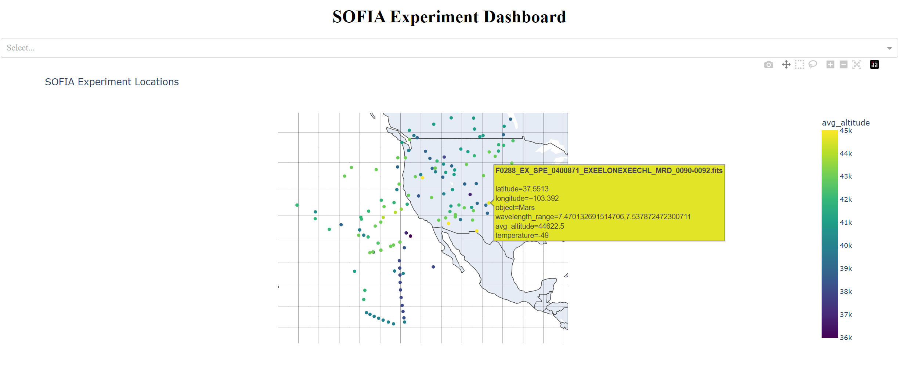

# SOFIA EXES Spectral Analysis Tool

Interactive Python dashboard to systematically identify and record atmospheric indications in EXES IR spectra from the [SOFIA IRSA Database](https://irsa.ipac.caltech.edu/Missions/sofia.html).

This project was developed as part of my [OSTEM internship at NASA Ames](https://www.nasa.gov/learning-resources/internship-programs/) under the direction of [Doug Hoffman](https://www.nasa.gov/people/doug-hoffman/) and [Naseem Rangwala](https://www.nasa.gov/people/naseem-rangwala/) during the Summer 2024 internship cycle.

This dashboard provides: 
* Visualizations and spectral analysis of the astrophysical data gathered by the SOFIA mission. 
* It combines this data with other publicly available data sets to identify atmospheric indications (essentially the mesosphere's molecular composition). 
* And finally, it let's the user find picks and fits to discover and quantification of the mesosphere's chemical composition. 

### Sofia Experiments Map 

First you select the desired Sofia experiment. 

### Spectra Visualizations

You can select an area of interest to zoom in. 

### Zoom in the Interesting Sections

Identify the picks.

### Pick Identification and Customization of Fits 

And select a custom fit.

